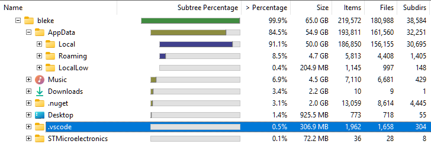
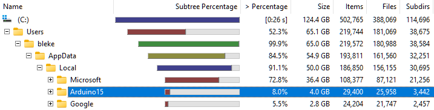

# ST-Link support for VSCode-Arduino
### situation
[Arduino 2 is problematic for me.](https://blekenbleu.github.io/static/Arduino2/)  
I installed [VSCode-Arduino Community](https://marketplace.visualstudio.com/items?itemName=vscode-arduino.vscode-arduino-community) without first uninstalling Arduino 2.  
- VSCode-Arduino discovered that installation and used it.  
- programming STM32 boards by ST-Link in that installation is broken for VSCode-Arduino  

*20 Aug 2025*  
- [Arduino STM32 core](https://github.com/stm32duino/Arduino_Core_STM32) at [release 2.7.1](https://github.com/stm32duino/Arduino_Core_STM32/releases/tag/2.7.1)
	was seemingly the last before [stlink programmer removal](https://github.com/stm32duino/Arduino_Core_STM32/commit/f9a35fd714b889475e067d8c2c72c551ea3c0cba),   
	but `boards.txt`, `platform.txt` and `programmers.txt` lack `stlink` back to at least 2.5.0...  

## Enable ST-Link for [VSCode-Arduino](https://blekenbleu.github.io/static/VSCodeArduino/programming.htm):  
- Download this ZIP and extract to a folder
- Download an appropriate [**arduino-cli** release](https://github.com/arduino/arduino-cli/releases) and copy its executible here.
- Configure vscode-arduino to find `arduino-cli` *in this folder*.  
- adding `GenF4.programmer.default=stlink` in `boards.txt` was essential to Black Pill uploading.
	- `Arduino: Upload` and `Arduino CLI: Upload` work;  
	- `Arduino CLI: Upload using Programmer` does *NOT*  
		- `stlink.programmer.transport_script={runtime.platform.path}/debugger/select_hla.cfg`  
			in `programmers.txt` did not help.  
- `boards.txt` **must be editted for each STM32 board *other than* Black Pill**,  
	according to [stm32duino Arduino_Core_STM32 Commit f9a35fd](https://github.com/stm32duino/Arduino_Core_STM32/commit/f9a35fd714b889475e067d8c2c72c551ea3c0cba)
	- that typically involves adding a single line `[whatever].programmer.default=stlink`  
	- Changes in `boards.txt`, `platform.txt` and `programmers.txt` here could instead  
	  probably be done in `Arduino15/packages/STMicroelectronics/tools/STM32Tools/*`
- Debugging in VSCode-Arduino may be a bridge too far;
	- [M$ seemingly dropped debugging at version 0.5.0](https://github.com/Tnthr/vscode-arduino-debug#visual-studio-code-extension-for-arduino-the-fork)
	- [Arduino_Core_STM32 added openocd debug](https://github.com/stm32duino/Arduino_Core_STM32/pull/1976/files#diff-5c378d0844f0422d4d813eabe83f61ffce82014d8b8aa3e93ee35ce2ca14ca7b)
		18 Mar 2023, [discussed here](https://github.com/stm32duino/Arduino_Core_STM32/issues/1896)

### Using VSCode-Arduino  
- [VSCode-Arduino instructions are IMO not great](https://github.com/vscode-arduino/vscode-arduino#installation)  
	Specifically, Arduino-CLI *by itself* **does not suffice**;&nbsp; an Arduino 2 IDE installation is wanted  
	- Arduino 1.8.7 may also still work, but e.g. STM32duino no longer supports it...
	- Arduino-CLI *implies Arduino 2 IDE*;&nbsp; Arduino 1 IDE does not use Arduino-CLI
- [**circuitstate.com** tutorial is IMO better](https://www.circuitstate.com/tutorials/how-to-use-vs-code-for-creating-and-uploading-arduino-sketches/);&nbsp;
	[**electronics-lab.com** how-to](https://www.electronics-lab.com/project/programming-arduino-platform-io-arduino-extension-visual-studio-code-editor/) is also good
	- MAKER-PRO Arduino extension on Visual Studio Code 2019 tutorial seems out of date
- VSCode-Arduino extension wants Platform.io Extension *disabled*;&nbsp; Platform.io requires Arduino sketch changes


## Using Arduino-CLI - [official documentation](https://arduino.github.io/arduino-cli)

VSCode-Arduino offers choosing CLI or IDE, with IDE option broken for Arduino 2.  
While VSCode-Arduino bundles Arduino-CLI as
`~\.vscode\extensions\vscode-arduino.vscode-arduino-community-0.7.2-win32-x64\assets\platform\win32-x64\arduino-cli\arduino-cli.exe`,  
VSCore-Arduino does not use `arduino-cli` until added to PATH or VSCode-Arduino settings.  

In VSCode-Arduino, setting non-blank `Arduino: Path` breaks VSCore-Arduino F1 `arduino` menu
- Arduino-CLI seemingly wants configuring outside VSCode-Arduino in `arduino-cli.yaml`  
	Arduino-CLI stores a default data directory, based on `--config-dir string`  
	and will search there for `arduino-cli.yaml`,  
  	- e.g.: `~/AppData/Local/arduino15/arduino-cli.yaml`  
- useful example configuration queries:
```
arduino-cli config dump
arduino-cli board listall mk
arduino-cli core list
arduino-cli outdated
```

[Thorough example for traditional arduino board](https://www.dumblebots.com/blog/arduino-cli-getting-started)  
[Arduino-cli: compile, upload and manage libraries, cores, and boards](https://www.pcbway.com/blog/Activities/Arduino_cli__compile__upload_and_manage_libraries__cores__and_boards.html)  
[Get specific configuration details from `arduino-cli` using `jq`](https://forum.arduino.cc/t/how-to-get-specific-configuration-details-using-arduino-cli/1176922/1)  
https://docs.arduino.cc/arduino-cli/getting-started/  
https://docs.arduino.cc/arduino-cli/configuration/  

[`arduino-cli` compile with custom board option](https://forum.arduino.cc/t/selecting-stm32f103cb-instead-of-default/1135893)

[Arduino-cli and VSCode (esp32)](https://cooling75.github.io/blog/arduino.html)

[Use newer Arcuino-CLI than bundled](https://forum.arduino.cc/t/board-change-and-upload-issue-stm32-nucleo-32/951464)

Despite specifying VSCode-Arduino and Arduino 2 Windows installation on another drive,  
 &emsp; much of their stuff ends up in  `~/.vscode` and `~/AppData/Local/Arduino15`:  
  

Since Microsoft and Google freely ignore user installation choices,
others seemlingly decided that must be cool...  
  
 &emsp; *FWIW, 35GB of `Microsoft` folder is VisualStudio Designer Cache...*

---

[Arduino IDE 2 ST-Link Debug](https://www.stm32duino.com/viewtopic.php?t=1707)

[VSCode Settings for Cortex-Debug](https://github.com/Marus/cortex-debug/wiki)

[Wokwi for Visual Studio Code provides STM32 simulation](https://docs.wokwi.com/vscode/getting-started)

**DeepWiki stm32duino/Arduino_Core_STM32**
[Architecture Overview](https://deepwiki.com/stm32duino/Arduino_Core_STM32/1-overview#architecture-overview)  
- `boards.txt`: Defines board-specific parameters  
	such as MCU model, flash/RAM sizes, clock frequencies, and upload methods.  
   Configures how boards appear in Arduino IDE and sets build parameters.  
- `platform.txt`: build toolchain configuration, compilation flags, and recipes.  
   Defines how Arduino sketches are compiled and linked for STM32 devices.  
- `programmers.txt`:  programmers for uploading code to STM32 boards  
- `SrcWrapper` library provides a unified interface to STM32Cube HAL and LL drivers across all STM32 families  

